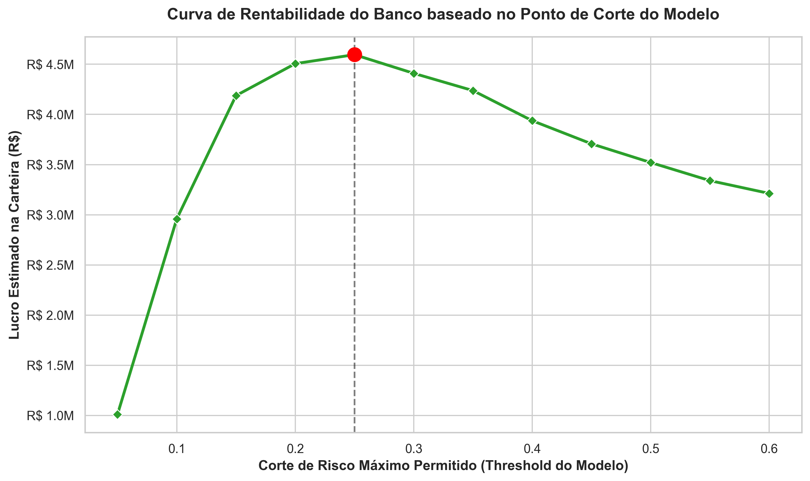
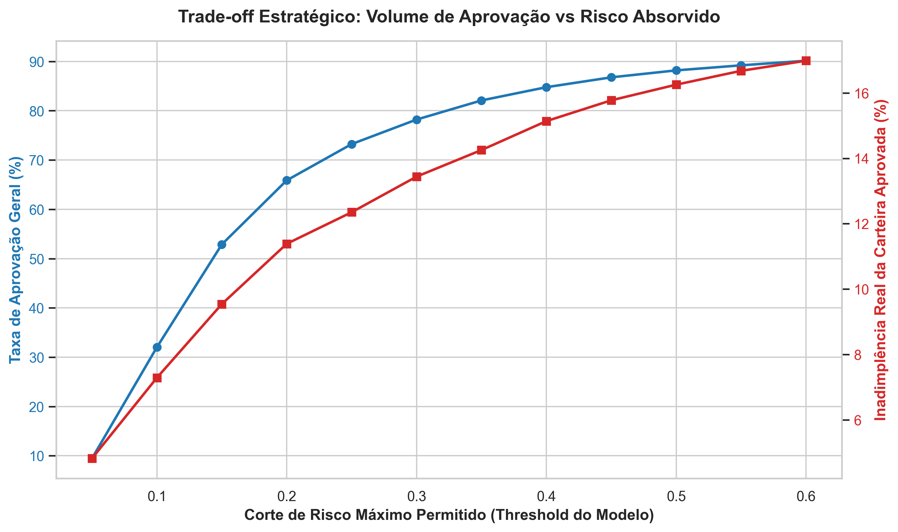

---

# 💳 Modelagem de Risco de Crédito com Engenharia de Features e Teoria dos Grafos

## 🚀 Resumo do Projeto

**Problema:**  
Modelos tradicionais de crédito avaliam clientes de forma isolada, ignorando padrões coletivos de comportamento financeiro.

**Solução:**  
Pipeline de Data Science combinando Machine Learning e Teoria dos Grafos para enriquecer a representação dos clientes.

**Resultados:**
- Melhor modelo: XGBoost tradicional (sem redes)
- AUC máximo: 0.7759
- Features de rede ajudaram apenas na Regressão Logística
- Simulação financeira:
  - Lucro: R$ 4,595,500
  - Threshold: 25%
  - Aprovação: 73.2%
  - Inadimplência: 12.4%

---

## 🔄 Pipeline do Projeto

```mermaid
flowchart TD
    A[Data Source<br>UCI Credit Card Dataset] --> B[EDA<br>Target • LIMIT_BAL • PAY_0 • Correlations]

    B --> C[Traditional Features<br>PAY_X • BILL_AMT • PAY_AMT • Demographics]
    B --> D[Graph Features<br>KNN Graph (k=5)<br>NetworkX<br>Degree • PageRank • Louvain]

    C --> E[Model Training<br>Logistic Regression • Random Forest • XGBoost]
    D --> E

    E --> F[Evaluation<br>AUC<br>XGBoost wins<br>Graphs help linear models]

    F --> G[Output<br>Probability of Default (PD)]

    G --> H[Business Simulation<br>+1500 good • -5000 default]

    H --> I[Optimal Threshold: 25%<br>Profit: R$ 4.59M]
```

---

## 🎯 Objetivo

Avaliar se métricas de grafos melhoram modelos de crédito e mensurar impacto financeiro real.

---

## 🧠 Metodologia

### 1. Engenharia de Features com Grafos
- Rede via KNN
- PageRank
- Degree
- Clustering
- Louvain

### 2. Modelagem
- Logistic Regression
- Random Forest
- XGBoost

Comparação:
- Baseline vs Enriquecido

### 3. Simulação Financeira
- Probabilidade → decisão
- Otimização de threshold

---

## 📊 Resultados

| Modelo | Baseline | Com Redes |
|--------|---------|----------|
| Logistic Regression | 0.7150 | 0.7195 |
| Random Forest | 0.7741 | 0.7736 |
| XGBoost | 0.7759 | 0.7719 |

Conclusão: XGBoost tradicional foi o melhor modelo.

---

## 💰 Simulação Financeira

- Receita por bom pagador: R$ 1.500  
- Perda por inadimplente: R$ -5.000  

Resultado ótimo:
- Threshold: 25%
- Lucro: R$ 4,595,500
- Aprovação: 73.2%
- Default: 12.4%



---

## 📉 Trade-off



---
## 📂 Estrutura de Diretórios

```
/
├── assets/                   # Imagens e gráficos gerados pelas análises
│ └── img/                    # Gráficos EDA, curvas ROC e simulações financeiras
├── data/
│ ├── raw/                    # Dados brutos (UCI Credit Card dataset)
│ └── processed/              # Dados enriquecidos com features de rede (.parquet)
├── notebooks/                # Núcleo analítico do projeto (pipeline de Data Science)
│ ├── 0_eda.ipynb
│ ├── 1_network_construction.ipynb
│ ├── 2_model_training.ipynb
│ └── 3_credit_strategy_simulation.ipynb
├── .gitignore                # Regras de exclusão de arquivos do versionamento
├── LICENSE                   # Licença MIT de uso e distribuição do código
├── README.md
└── requirements.txt          # Dependências do projeto
```
---

## 🛠️ Stack

- Python
- Pandas / NumPy
- Scikit-learn
- XGBoost
- NetworkX
- Matplotlib / Seaborn

---
## 📥 Dataset

O dataset utilizado neste projeto é público e pode ser baixado em:

https://www.kaggle.com/datasets/uciml/default-of-credit-card-clients-dataset

Após o download, coloque o arquivo `UCI_Credit_Card.csv` na pasta:

```
data/raw/
```

## 🚀 Como Executar

### 1. Clone

```
git clone https://github.com/lbaffa/predicao-de-inadimplencia-com-grafos.git
cd predicao-de-inadimplencia-com-grafos
```

### 2. Ambiente

```
python -m venv venv
```

Windows:

```
venv\Scripts\activate
```

Linux/Mac:

```
source venv/bin/activate
```

### 3. Dependências

```
pip install -r requirements.txt
```

### 4. Executar notebooks

```
0_eda.ipynb
1_network_construction.ipynb
2_model_training.ipynb
3_credit_strategy_simulation.ipynb 
```
---

## 💡 Insights

- Grafos não melhoram modelos baseados em árvores
- AUC não representa valor de negócio
- Threshold é problema econômico
- Feature engineering precisa ser validado empiricamente

---

## 📜 Licença

MIT License
